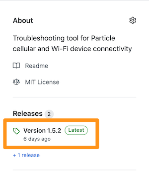

# Cloud Debug - Tool for debugging cellular, Wi-Fi and cloud connectivity issues

## Installing

### Using the Chrome browser

If you are using the Chrome web browser on Windows 10, Mac, Linux, Chromebook, or some Android phones, you can install cloud debug right from the web page with no additional software to download or install.

[Web-based Cloud Debug Install](https://docs.particle.io/cloud-debug/)

This feature is not available on other browsers or iOS devices (iPhone and iPad).

### Install the Particle CLI

If you haven't already installed the [Particle CLI](https://docs.particle.io/tutorials/developer-tools/cli/), so should do so now. 

Once installed, you will enter Particle CLI commands in a Command Prompt or Terminal window.

### Update Device OS

The cloud debug binaries target a variety of versions of Device OS (see release notes, below). 

If you have an older version of Device OS installed you will want to manually upgrade it by USB. While devices can update Device OS OTA (over-the-air), presumably if you need the cloud debugging tool you're having trouble connecting to the cloud, and thus will not be able to upgrade OTA.

The easiest method is to use the web-based installer, above. However you can often use the Particle CLI:

- Connect the device by USB to your computer.
- Enter DFU mode (blinking yellow) by holding down MODE button and tapping RESET. Continue to hold down MODE while the status LED blinks yellow until it blinks magenta (red and blue at the same time) and release.
- Enter the following command in a Terminal or Command Prompt window:

```
particle update
```

The exception is the P2. The `particle update` command does not update to Device OS 5.0.1 needed by cloud debug.

### Download the binary

The binaries are included in Github as releases. The latest release is on Github on the right-hand size of the window under **Releases**



The releases match the major and minor version of Device OS that's targeted. For example, 1.5.1 targets 1.5.x, in this case 1.5.2. As other versions of cloud-debug are released, those will have increasing patch versions, like 1.5.1, 1.5.2, etc.. The last digit will continue to increase for each new version of the cloud-debug code and does not exactly match the Device OS version!

Because binaries are generally compatible with later versions of Device OS, you don't need to have an exact match on the Device OS versions and you do not need to downgrade your Device OS binary.

Since user firmware binaries are backward compatible, the 1.5.1 version will work on 2.0.x and 3.0.x, but if we need to take advantage of features only included in a later version we may include multiple binary targets in the future.

There is a pre-built binary for each device that is supported, such as:

| Gen   | Network  | Name | Details |
| :---: | :------- | :--- | :--- |
| Gen 2 | Wi-Fi    | photon.bin | |
| Gen 2 | Wi-Fi    | p1.bin | |
| Gen 2 | Cellular | electron.bin | Also E Series, all SKUs |
| Gen 3 | Wi-Fi    | argon.bin | |
| Gen 3 | Wi-Fi    | p2.bin | |
| Gen 3 | Cellular | boron.bin | Both Boron 2G/3G (BRN310, BRN314) and Boron LTE (BRN402, BRN404, BRN404X) |
| Gen 3 | Cellular | bsom.bin | B Series LTE Cat M1 (North America) (B402, B404, B404X) |
| Gen 3 | Cellular | b5som.bin | B Series LTE Cat 1 with 2G/3G (EMEAAA) (B523, B524) |
| Gen 3 | Cellular | tracker.bin | Tracker SoM and Tracker One, T402, T404, T523, T524, and equivalent ONE models |

### Flashing the binary to the device

- Connect the device by USB to your computer.
- Enter DFU mode (blinking yellow):

```
particle usb dfu
```

- Enter the following command in a Terminal or Command Prompt window:

```
cd Downloads
particle flash --usb boron.bin
```

Modify the cd command if you've saved the binary somewhere else. And of course replace boron.bin with the bin file for your device.


## Viewing the logs

The easiest way to view the logs is to use the Particle CLI:

```
particle serial monitor
```

Note, however, that particle serial monitor is only a monitor. You cannot type commands into the window to control the device. For that, see the section below, Using the command line.

### Decoding the logs

These application notes may help decode the logs.

- [AN003 Interpreting Cloud Debug](https://docs.particle.io/datasheets/app-notes/an003-interpreting-cloud-debug/) shows how to interpret cloud debugging logs to troubleshoot various common issues.
- [AN004 Interpreting Cloud Debug-2](https://docs.particle.io/datasheets/app-notes/an004-interpreting-cloud-debug-2/) is a deep dive into interpreting cloud debug logs and cross-referencing the AT command guide for the u-blox modem.

## Using the cloud debug command line

The particle serial monitor command is handy for viewing the output from the cloud debug tool. However, you can't type commands to control the tool with it.

### Mac and Linux

On Mac OS (OS X) and Linux systems, you can access the serial port through the terminal.

For Mac OS, open the terminal and type:

```
screen /dev/tty.u
```

and pressing tab to autocomplete.

On Linux, you can accomplish the same thing by using:

```
screen /dev/ttyACM
```

and pressing tab to autocomplete.

Now you are ready to read data sent by the device over Serial and send data back.


### Windows

For Windows users, we recommend downloading [PuTTY](http://www.putty.org/). Plug your device into your computer over USB, open a serial port in PuTTY using the standard settings, which should be:

- Baud rate: 9600
- Data Bits: 8
- Parity: none
- Stop Bits: 1


### Cellular commands

#### cellular

```
> cellular -c
> cellular -d
```

Connect (-c) or disconnect (-d) from cellular. This only will work reliably after you've successfully connected to the cellular. Executing this during a cloud test may fail.

#### setCredentials

```
> setCredentials -a "broadband"
```

Sets the APN, and optionally the username and password, for a 3rd-party SIM card. 

| Parameter | Details | Required |
| :--- | :--- | :--- |
| -a | APN | Yes |
| -u | Username | No |
| -p | Password | No |


Boron: This setting is persistent and will stay in effect through reboots and Device OS upgrades.

Electron 2G/3G: Supported, however the setting is not persistent and will be reset when the cellular modem is powered down.

B Series SoM, Tracker SoM, E Series, Electron LTE: Not supported as these devices do not support 3rd-party SIM cards.

#### clearCredentials

```
> clearCredentials
```

Clears the APN, username, and password for a 3rd-party SIM card. This setting is persistent and will stay in effect through reboots and Device OS upgrades.

Supported on the Boron only. The B Series SoM and Tracker SoM do not support 3rd-party SIM cards.

On the Electron and E Series, removing all power (battery and USB) for 10 seconds will reset credentials.

#### setActiveSim

```
> setActiveSim -i
> setActiveSim -e
```

Sets the active SIM card to internal Particle SIM (-i) or external (-e). This setting is persistent and will stay in effect through reboots and Device OS upgrades.

Supported on the Boron only. The B Series SoM and Tracker SoM do not support 3rd-party SIM cards.

Note: On the Boron LTE you must not only set the SIM to internal (-i) but you must physically remove the SIM card from the 4FF nano SIM card slot as well.


#### mnoprof

```
> mnoprof 100
```

Sets the Mobile Network Operator Profile number on Boron LTE Cat M1 devices. Setting this incorrectly will prevent the device from connecting to cellular (stuck on blinking green). 

You will need to reset the modem after setting the MNO profile. Sending the command `AT+CFUN=15` is one way.

Supported on the Boron LTE only. The B Series SoM and Tracker SoM do not support 3rd-party SIM cards. This setting is persistent and will stay in effect through reboots and Device OS upgrades.

#### command

```
> command AT
> command AT+COPS=3
```

Send a raw AT command to the modem. Everything after "command" is passed directly to Cellular.command, and a `\r\n` is appended to the end. Trace logging is enabled for the duration of the command so you can see the results.

### Wi-Fi commands

#### wifi

```
> wifi -c
> wifi -d
```

Connect (-c) or disconnect (-d) from Wi-Fi. This only will work reliably after you've successfully connected to the Wi-Fi. Executing this during a cloud test may fail.

#### antenna 

```
> antenna -i
> antenna -e
> antenna -a
```

Select the Wi-Fi antenna on the Photon, P0, and P1. This option is persistent and will stay in effect through reboots, Device OS upgrades, and reset credentials.

| Option | Use | Details |
| :--- | :--- | :--- |
| -i | Internal | Default on Photon and P1 |
| -e | External | External (U.FL connector) |
| -a | Automatic | Available on Photon and P1, not normally enabled |

The Argon does not have an internal antenna and does not support this option.

#### clearCredentials

```
> clearCredentials
```

This command clears Wi-Fi credentials. 

Supported on the Photon, P1, and Argon.


#### setCredentials

```
> setCredentials -s "My Network" -p "secret"
> setCredentials -s "My Network" -p "secret" -t WPA
```

This command sets Wi-Fi credentials. The setting is persistent and survives reset and Device OS upgrades.

| Parameter | Details | Required |
| :--- | :--- | :--- |
| -s | SSID | Yes |
| -p | Password | Yes, unless the network is open/unsecured |
| -t | Authentication Type | No, unless the AP is not available |

The authentication type is inferred when the network is able to be connected to when setCredentials is called. However, if you are pre-configuring authentication credentials for networks not available at the time of the call, you must specify the authentication type (case-sensitive):

- WEP
- WPA
- WPA2

Supported on the Photon, P1, and Argon.

#### useDynamicIP

```
> useDynamicIP
```

Sets dynamic IP address mode. This is the factory default, and resets a static IP set with useStaticIP. 

This option is persistent and will stay in effect through reboots, Device OS upgrades, and reset credentials.

Supported on the Photon and P1 only. The Argon does not support static IP addresses.

#### setStaticIP

```
> setStaticIP -a 192.168.1.5 -s 255.255.255.0 -g 192.168.1.1 -d 192.168.1.1
```

Sets static IP address mode. This option is persistent and will stay in effect through reboots, Device OS upgrades, and reset credentials. All four parameters are required:

| Parameter | Details | Required |
| :--- | :--- | :--- |
| -a | IP address | Yes |
| -s | Subnet mask | Yes |
| -g | Gateway address | Yes |
| -d | DNS server address | Yes |

Supported on the Photon and P1 only. The Argon does not support static IP addresses.

### Common commands

#### keepAlive

```
> keepAlive 5
```

Set the Particle Cloud keep-alive value in minutes. 

This is available on:

- Gen 2 cellular devices (Electron, E Series)
- Gen 3 devices (Argon, Boron, B Series SoM, Tracker SoM)

#### cloud

```
> cloud -c
> cloud -d
```

Connect (-c) or disconnect (-d) from the cloud. This only will work reliably after you've successfully connected to the cloud. Executing this during a cloud test may fail.

#### trace

```
> trace -e
> trace -d
```

Enable (-e) or disable (-d) trace logging. This affects how verbose the logs are. On the Electron/E Series in particular, the logs get very long in trace mode.

#### safeMode

```
> safeMode
```

Enter safe mode (breathing magenta). However, if you are having cloud connection problems, this may not work as in order to enter safe mode, you need to be able to connect to the cloud.

#### dfu

```
> dfu
```

Enter DFU mode (blinking yellow). It may make more sense to use `particle usb dfu` but this command is available.


## Cellular tower scan

Some devices with cellular modems can do a tower scan, which shows available GSM cellular carriers.

| Device | Tower Scan Supported |
| :--- | :---: |
| Electron G350 | &check; |
| Electron U260 | &check; |
| Electron U270 | &check; |
| E Series E310 | &check; | 
| E Series E402 | |
| Boron 2G/3G | &check; |
| Boron LTE | |
| B Series B402 | |
| B Series B523 | |
| Tracker T402 | |
| Tracker T523 | |

Of note:

- This does not work on LTE Cat M1 devices (E402, Boron LTE, B402) or Quectel devices (B523, Tracker SoM) as the hardware does not support it.
- It can only detect towers that support 2G/3G (not LTE or LTE Cat M1).
- It takes a few minutes to scan for towers.

To use the tower scan, use the `tower` command from the cloud debug command line, or tap the MODE button within the first 10 seconds after booting.


## Removing

You can remove the software by flashing another application, either your own, or a standard application like Tinker.

To do it using the CLI:

- Connect the device by USB to your computer.
- Enter DFU mode (blinking yellow) by holding down MODE button and tapping RESET. Continue to hold dowh MODE while the status LED blinks yellow until it blinks magenta (red and blue at the same time) and release.
- Enter the following command in a Terminal or Command Prompt window:

```
particle flash --usb tinker
```

## Building from source

You can also build cloud-debug from source. You may want to do this to customize behavior, such as logging to Serial1 (USART serial) instead of USB serial on a P1 or B Series SoM without USB. 

Note that you cannot target versions of Device OS older than 1.2.1. The code requires features built into that version and will not compile on earlier versions. 

### In Particle Workbench

- Clone [this repository](https://github.com/particle-iot/cloud-debug).
- In Particle Workbench use **Particle: Import Project** to load the project.
- Select your device type and Device OS version using **Particle: Configure Project For Device**
- Build (either local or cloud)!

Note that there are several libraries required. These are automatically loaded from the project.properties file.

- [CellularHelper](https://github.com/particle-iot/CellularHelper)
- [SerialCommandParserRK](https://github.com/rickkas7/SerialCommandParserRK)
- [CarrierLookupRK](https://github.com/rickkas7/CarrierLookupRK)

Because of the number of files and libraries, it's not particularly convenient to use the Web IDE; it's much easier to use Workbench or the CLI compiler.

### In Particle CLI

- Clone [this repository](https://github.com/particle-iot/cloud-debug).
- Build it using the Particle CLI (cloud compile):

```
cd cloud-debug
particle compile boron . --target 2.0.0-rc.2 --saveTo boron.bin
```

## Handy New Features

If you've used the previous versions of [Electron Cloud Debug](https://github.com/rickkas7/electron-clouddebug), [Photon Cloud Debug](https://github.com/rickkas7/photon-clouddebug), or [Boron Cloud Debug](https://github.com/rickkas7/boron-clouddebug), there are a bunch of new features that make troubleshooting more productive.

More information about versions is now displayed:

```
0000015479 [app] INFO: Platform: Boron
0000015479 [app] INFO: Binary compiled for: 1.5.2
0000015480 [app] INFO: Cloud Debug Release 1.5.1
0000015480 [app] INFO: System version: 2.0.0-rc.2
0000015481 [app] INFO: Device ID: e00fce6ffffffffe7d5cd238
```

Power source and battery information is displayed (when available):

```
0000015340 [app] INFO: Power source: USB Host
0000015342 [app] INFO: Battery state: charged, SoC: 77.48
```

On devices with a bq24195 PMIC (Electron, E Series, Boron, Tracker SoM), some common settings are displayed now:

```
0000023359 [app] INFO: PMIC inputVoltageLimit: 3880 mV
0000023360 [app] INFO: PMIC inputCurrentLimit: 500 mA
0000023361 [app] INFO: PMIC minimumSystemVoltage: 3500 mV
0000023362 [app] INFO: PMIC chargeCurrentValue: 896 mA
0000023362 [app] INFO: PMIC chargeVoltageValue: 4112 mV
```

Several commands are now decoded and helpful information is shown as [app.help] messages:

```
0000034916 [ncp.at] TRACE: > AT+UMNOPROF?
0000034923 [ncp.at] TRACE: < +UMNOPROF: 2
0000038600 [app.help] INFO: Mobile Network Operator Profile (UMNOPROF): AT&T (2)
```

```
0000026000 [ncp.at] TRACE: > AT+CREG?
0000026000 [ncp.at] TRACE: < +CREG: 2,5,"2CF7","8AFFF6F",6
0000026493 [app.help] INFO: Network registration (CREG) Status: registered, roaming (5)
0000026494 [app.help] INFO: Tracking area code: 2CF7
0000026494 [app.help] INFO: Cell identifier: 8AFFF6F
0000026495 [app.help] INFO: Access technology: GSM + HSDPA & USUPA (6)
0000026000 [ncp.at] TRACE: < OK
```

```
0000031664 [ncp.at] TRACE: > AT+USOCTL=1,0
0000031672 [ncp.at] TRACE: < +CME ERROR: operation not allowed
0000031675 [app.help] INFO: operation not allowed is expected here.
```

```
0000038054 [ncp.at] TRACE: > AT+CSQ
0000038059 [ncp.at] TRACE: < +CSQ: 13,3
0000038063 [app.help] INFO: Signal Quality (CSQ): rssi=-87 dBm qual=3 (0-7, lower is better)
0000038061 [ncp.at] TRACE: < OK
```

Operator codes (MCC/MNC) are decoded world-wide. The database is in the cloud debug firmware so it works without cellular and on all modems.

```
0000044000 [ncp.at] TRACE: > AT+COPS?
0000044000 [ncp.at] TRACE: < +COPS: 0,2,"310410",2
0000044254 [app.help] INFO: Operator Selection (COPS) Read: mode=automatic (0)
0000044255 [app.help] INFO:   format=numeric (2)
0000044257 [app.help] INFO:   oper=310410 carrier=AT&T Wireless Inc. country=United States
```

Information about the carrier, signal strength, power source, and battery is periodically displayed for cellular devices:

```
0000064023 [app] INFO: Cloud connected for 00:30
0000065817 [app] INFO: Cellular Info: cid=149999050 lac=11511 mcc=310 mnc=410
0000065818 [app] INFO: Carrier: AT&T Wireless Inc. Country: United States
0000065848 [app] INFO: Technology: 3G, Band: UMTS 850
0000065868 [app] INFO: Strength: 36.5, Quality: 75.5, RAT: 3G
0000065868 [app] INFO: Power source: USB Host
0000065869 [app] INFO: Battery state: charged, SoC: 99.96
```

It shows the technology, general frequency (700, 850, 900, etc.), and band number for LTE:

```
0000247585 [app] INFO: Technology: LTE Cat M1, Band: LTE 700 (B12)
```

It keeps track of how long connecting to cellular and connecting to the cloud take:

```
0000224665 [app] INFO: Still trying to connect to cellular 03:11
```

```
0001557289 [system] INFO: Cloud: disconnected
0001557290 [app] INFO: Lost cloud connection after 25:27
```

Logging of the modem information is now delayed until the modem is responding to commands:

```
0000026472 [app] INFO: manufacturer: u-blox
0000026478 [app] INFO: model: SARA-U260
0000026484 [app] INFO: firmware version: 23.20
0000026501 [app] INFO: ordering code: SARA-U260-00S-00
0000026512 [app] INFO: IMEI: 359999999907929
0000026524 [app] INFO: ICCID: 8934000000000004028
```

When cloud connected it logs the device name and public IP address (for both cellular and Wi-Fi):

```
0000041093 [app] INFO: Device name: electron3
0000041498 [app] INFO: Public IP address: 176.83.141.209
```

It periodically shows signal strength and base station MAC address for Wi-Fi:

```
0000072193 [app] INFO: Cloud connected for 00:20
0000072195 [app] INFO: rssi=-72.0 bssid=FC:FF:FF:FF:0C:55
```

It can detect if Ethernet is present, and logs IP address information when present:

```
0000015342 [app] INFO: This device could have Ethernet (is 3rd generation)
0000015344 [app] INFO: FEATURE_ETHERNET_DETECTION not enabled, so Ethernet will not be used (even if present)
```

On the Electron and E Series the extraordinarily verbose logs are now tamed and look like the Gen 3 logs with just the essential command and response information. If you really want the old behavior back, the `literal -e` (enable) cloud debug command will turn on the old, completely unfiltered behavior. 

```
    42.009 AT send      36 "AT+USOST=1,\"3.210.194.186\",5684,33\r\n"
    42.017 AT read  >    3 "\r\n@"
    42.017 AT send      33 "\x17\xfe\xfd\x00\x01\x00\x00\x00\x00\x00\r\x00\x14\x00\x01\x00\x00\x00\x00\x00\r\xb9P\xae\xb2\xa3\x8b\x93|N\a\x94u"
    42.153 AT read  +   16 "\r\n+USOST: 1,33\r\n"
    42.154 AT read OK    6 "\r\nOK\r\n"
    42.154 AT send       4 "AT\r\n"
    42.157 AT read OK    6 "\r\nOK\r\n"
    42.157 AT send      14 "AT+USORF=1,0\r\n"
    42.164 AT read  +   15 "\r\n+USORF: 1,0\r\n"
Socket 1: handle 1 has 0 bytes pending
    42.167 AT read OK    6 "\r\nOK\r\n"
```


## Version History

### 4.0.5 (2022-09-23)

- Report MNO profile 100 as manual band configuration instead of European to reduce confusion
- Targets Device OS 2.3.0 on Electron/E Series, P1, and Photon
- Targets Device OS 4.0.0 on argon, boron, bsom, b5som, tracker
- Targets Device OS 5.0.1 on p2

### 2.1.4 (2021-06-16)

- Fix modem information sometimes not reported on Gen 3 (ch70101)
- Targets device OS 2.1.0 on all platforms

### 1.5.3 (2020-10-21)

- Fixed erroneous help message on read of CREG/CEREG/CGREG; displayed set help, not read help.
- README clarifications

### 1.5.2 (2020-10-15)

- Fixed memory leak on Quectel devices
- Added memory usage reporting

### 1.5.1 (2020-10-07)

- Initial preview/testing version


